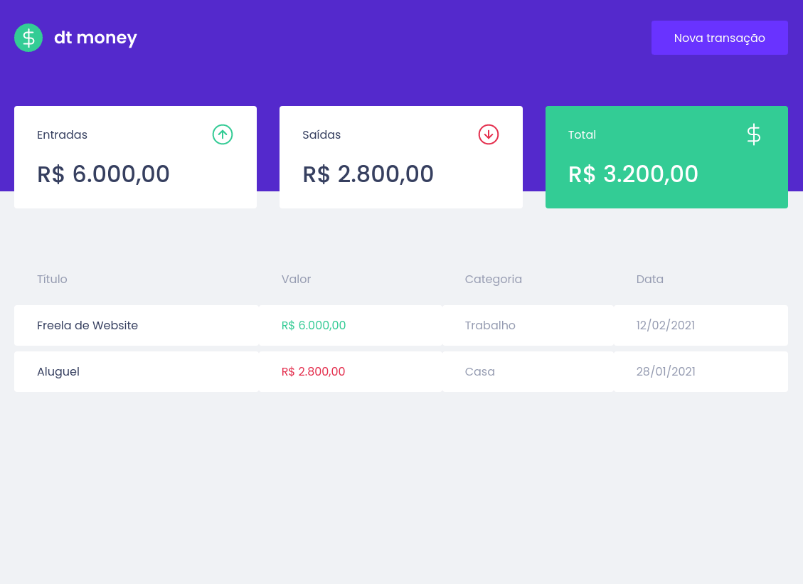

<h1 align="center">
  
</h1>

<h4 align="center">A ReactJS app organize your finances</h4>

<p align="center">
  

  

  

  <a href="https://www.linkedin.com/in/caiotracera/">
    
  </a>
  <br />
  <a href="https://github.com/caiotracera/dtmoney/commits/master">
    
  </a>

  <a href="https://github.com/caiotracera/dtmoney/issues">
    
  </a>

  

  
</p>

<blockquote align="center">
“You don’t learn to walk by following rules. You learn by doing, and by falling over.”
</blockquote>

<p align="center">
  <a href="#rocket-about-the-project">About the project</a>&nbsp;&nbsp;&nbsp;|&nbsp;&nbsp;&nbsp;
  <a href="#man_technologist-technologies">Technologies</a>&nbsp;&nbsp;&nbsp;|&nbsp;&nbsp;&nbsp;
  <a href="#wrench-getting-started">Getting started</a>&nbsp;&nbsp;&nbsp;|&nbsp;&nbsp;&nbsp;
  <a href="#pencil2-todo">Todo</a>&nbsp;&nbsp;&nbsp;|&nbsp;&nbsp;&nbsp;
  <a href="#memo-license">License</a>&nbsp;&nbsp;&nbsp;|&nbsp;&nbsp;&nbsp;
  <a href="https://dtmoney-lac-one.vercel.app/" target="_blank" rel="noopener noreferrer">Demo</a>&nbsp;&nbsp;&nbsp;|&nbsp;&nbsp;&nbsp;
  <a href="https://www.figma.com/file/VS9m4iaRFH4XMydtmqAII9/dtmoney?node-id=0%3A1" target="_blank" rel="noopener noreferrer">Layout</a>
</p>

<div align="center">
  
</div>

# :rocket: About the project

<b>DTMoney</b> is a simple ReactJS application made for studies. It allows you to organize your finances by adding the what you earn and what you spend.

<b>Obs.:</b> As MirageJS does not work in production, <b>the demo is not fully functional.</b>

# :man_technologist: Technologies

* React.JS
* Styled-Components
* Axios
* Date-fns
* MirageJS
* react-modal
* Polished
* TypeScript
* ESLint
* Prettier

# :wrench: Getting started

In order to run this project, you must have installed <a href="https://nodejs.org/en/">Node.js</a>
and <a href="https://git-scm.com/">Git SCM</a>. If you met all the requirements, follow the instructions:

<b>Clone the project</b>

```shell
$ git clone https://github.com/caiotracera/dtmoney
$ cd dtmoney
```

<b>Start the project</b>

```shell
$ npm install # Install all dependencies
$ npm run build # Generate the production build
$ npm run start # Initiate the project at http://localhost:3000/
```

# :pencil2: Todo

- [ ] Replace MirageJS by a real backend in onder to make the demo work in production.

# :memo: License

Made with :sparkling_heart: by Caio.
<br />
:coffee: Can we have a coffe? <a href="https://www.linkedin.com/in/caiotracera/">Get in touch!</a>
